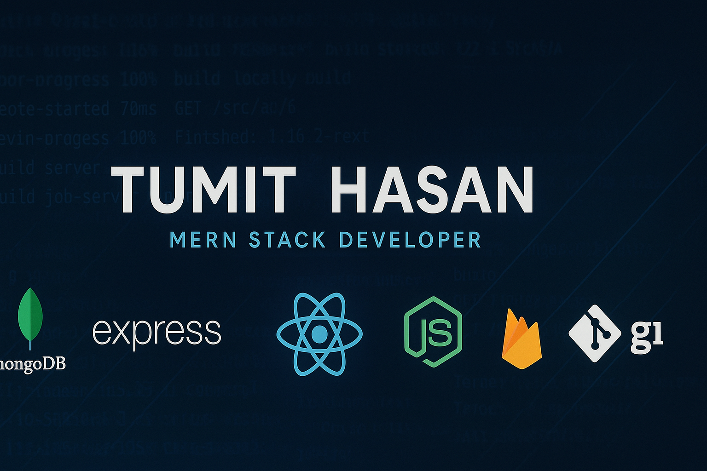

<h1 align="center">Hi 👋, I'm TUMIT HASAN</h1>
<h3 align="center">🚀 MERN Stack Developer</h3>

  
  

  

---

## 🧑‍💼 About Me

💻 MERN Stack Developer | 🌍 Passionate about Modern Web Technologies | 🚀 Building Scalable & Efficient Web Apps  

Hello! I'm Tumit Hasan, a dedicated MERN Stack developer who loves creating performant and user-friendly web applications. I enjoy working with both frontend and backend technologies to deliver full-stack solutions.  

🎓 Currently in final semester of Computer Science and Engineering at Satkhira Polytechnic Institute.  

🛠️ Skills I Bring:  
🌈 Frontend: HTML, CSS, JavaScript, React.js, Tailwind CSS 
🛡️ Backend: Node.js, Express.js 
🗃️ Database: MongoDB, Firebase Realtime Database 
🔐 Authentication & Security: JWT, Firebase Authentication  

🎯 Currently focused on mastering Next.js and Redux for advanced frontend development.  

🎨 Passionate about writing clean, maintainable code and building creative solutions that make a difference.  

🎮 Fun Fact: When I’m not coding, I love playing Free Fire on my MSI Emulator 🎮  

🌟 Favorite Quote: “Never stop learning because life never stops teaching.”  

🌟 Inspiration: Jhankar Mahbub

  
📍 **Location:** Bangladesh  
📧 **Email:** tumithasan1@gmail.com  
📞 **Phone:** 01611960330  

---

## 🚀 What I'm Working On

- 🔭 Building: **Volunteer Hub Fullstack Project**
- ⚒️ Exploring: **Next.js**
- 🧪 Learning: **Advanced backend security & authentication**
- 🌐 Hosting Projects On: **Firebase, Vercel, Netlify**

---

## 🛠️ Skills & Tools

 
  
  
  
  
  
  
   
   
  
  
   
  

---

## 🌟 GitHub Stats

  
   
  
   
  
   
  
   
  

---

## 🌐 Connect With Me

  
  
  
  
  

---

## 📈 Visitor Count

  

---

⭐️ If you like my work, consider giving a star to my repositories!  
🤝 Always open to collaborations and learning opportunities.

