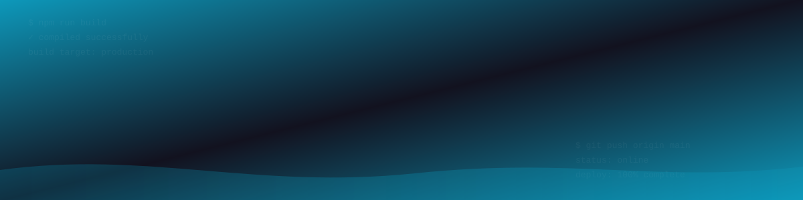

 

[About](#-about-me) &nbsp;·&nbsp; [Tech Stack](#%EF%B8%8F-tech-stack) &nbsp;·&nbsp; [Analytics](#-github-analytics) &nbsp;·&nbsp; [Projects](#-featured-projects) &nbsp;·&nbsp; [Contact](#-reach-me)

 

### 🧑‍💻 About Me

- 🎓 Final-semester CSE student at **Satkhira Polytechnic Institute**
- 💻 A **Full Stack Developer** working across **MERN, Next.js, and WordPress** to build performant, user-friendly web apps
- 🏢 **1+ year of professional experience** at **Exprovia**
- 📍 Based in **Jashore, Khulna, Bangladesh**
- 🧩 Comfortable across the full spectrum — custom React/Next.js apps, WordPress theme/plugin customization, and full backend development
- 🔭 Currently building **Volunteer Hub** — a fullstack MERN project
- 🌱 Exploring advanced backend security & authentication
- 🌐 Deploying on **Firebase, Vercel, Netlify**
- 🏏 Off the keyboard, you'll find me playing **cricket**
- 🌟 Inspired by **Jhankar Mahbub** and **Rasel Mridha** (mentor & friend)

> *"Never stop learning because life never stops teaching."*

 

### 🌐 Portfolio & Links

### 📫 Reach Me

  
  
  
  
  
  

📍 **Location:** Jashore, Khulna, Bangladesh &nbsp;|&nbsp; 📞 **Phone:** 01611960330

### 💼 Experience

**Full Stack Developer** — **Exprovia** &nbsp;·&nbsp; *1+ year*

> Working on full-stack web development spanning **MERN stack applications**, **Next.js projects**, and **WordPress-based client solutions**, contributing to real-world production builds and client-facing deliverables.

### 🛠️ Tech Stack

  

| Category | Stack |
|:--|:--|
| **Frontend** | HTML5 · CSS3 · JavaScript · React.js · Next.js · Tailwind CSS |
| **Backend** | Node.js · Express.js |
| **CMS** | WordPress (theme & plugin customization, Elementor, WooCommerce) |
| **Database** | MongoDB · Firebase Realtime Database |
| **Auth & Security** | JWT · Firebase Authentication |
| **Tools** | Git · Figma · VS Code |

### 📊 GitHub Analytics

  
  

  

  

  

### 📈 Live Metrics Dashboard

  

Auto-updated daily via GitHub Actions — contribution calendar, top languages, coding habits & achievements in one place.

### 📌 Featured Projects

| Project | Description | Tech |
|:--|:--|:--|
| [**App Orbit — Client**](https://github.com/tumit-h-r-75/App-orbit-client) | Frontend of a full-stack MERN application | React, Tailwind CSS |
| [**App Orbit — Server**](https://github.com/tumit-h-r-75/app-orbit-server) | Backend API powering App Orbit | Node.js, Express, MongoDB |
| [**Roommate Finder**](https://github.com/tumit-h-r-75/assignment-10-roommate-finder) | Full-stack app to help users find compatible roommates | React, Firebase, MongoDB |
| [**Assignment 11 — Client**](https://github.com/tumit-h-r-75/assigment-11-client) | React-based client-side project | React, Tailwind CSS |
| [**Assignment 11 — Server**](https://github.com/tumit-h-r-75/assigment-11-server) | REST API backend for Assignment 11 | Node.js, Express, MongoDB |

🔗 See all repositories on my <a href="https://github.com/tumit-h-r-75?tab=repositories">GitHub profile</a>

### 🏆 GitHub Achievements

  
  

<b>Pull Shark ×2</b> &nbsp;&nbsp;·&nbsp;&nbsp; <b>Quickdraw</b>

⭐️ **If you like my work, consider starring my repositories!**
&nbsp;&nbsp;·&nbsp;&nbsp;
🤝 **Always open to collaborations, freelance gigs, and learning opportunities.**

 

